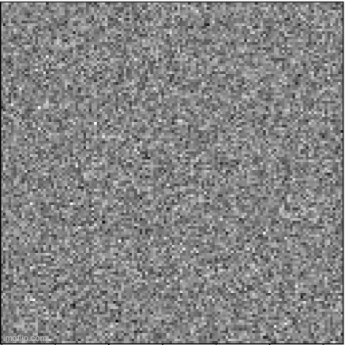

# Diffusion Model for Chinese Calligraphy

#### Motivation
Calligraphy is a significant form of art and culture. In this project, I aim to diversify calligraphic expressions through AI generation, expanding the realm of calligraphic art!

#### Tools and Data
* Diffusion model training structure
* UNET and CS attention
* ~1000 calligraphy figures

#### Module
* Pytorch
* Opencv

#### Result
> The generated pictures:

#### Brief summary
In this project, I train the diffusion model from scratch, and figure out its amazing creation ability!
This stuff can be effectively used in developing new calligraphy styles.

#### Reference
* https://wandb.ai/capecape/train_sd/reports/How-To-Train-a-Conditional-Diffusion-Model-From-Scratch--VmlldzoyNzIzNTQ1
* https://github.com/tcapelle/Diffusion-Models-pytorch?organization=tcapelle&organization=tcapelle
